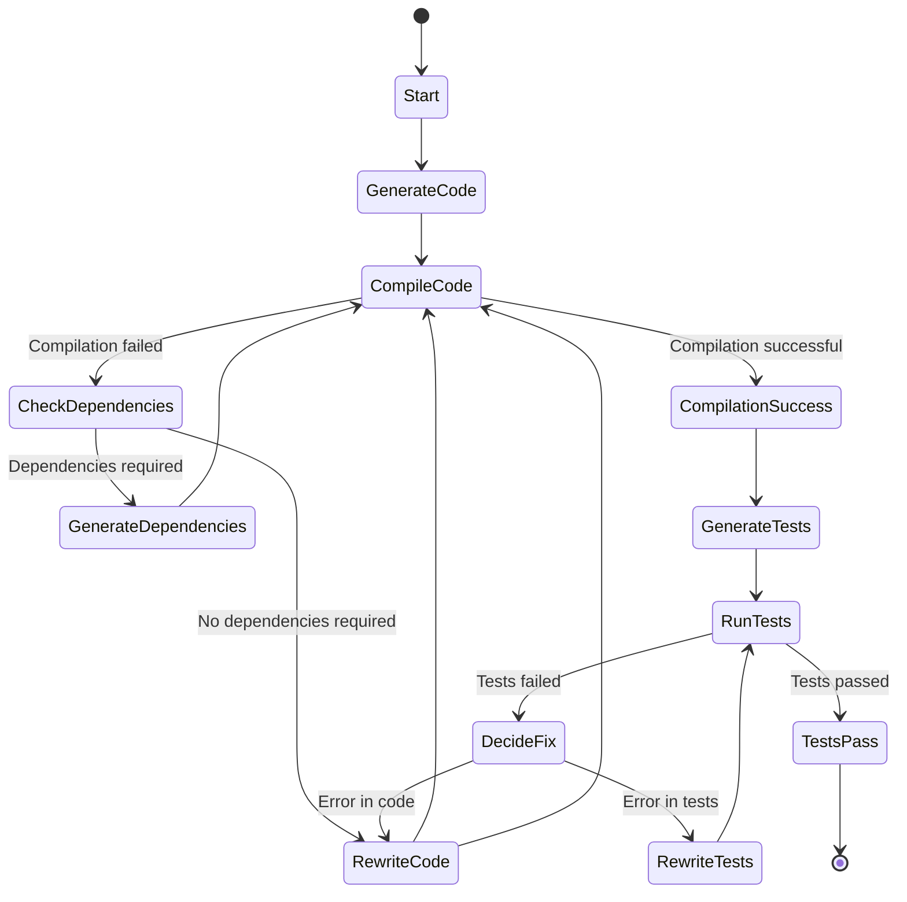

# LMM Logic Exec Verify

A Rust-based tool that automates the generation, compilation, and testing of code using Language Model Models (LLMs). It interacts with LLMs to generate code based on user-provided explanations, compiles the code, resolves dependencies, and runs tests to ensure functionality.

## Table of Contents

- [Features](#features)
- [Installation](#installation)
- [Usage](#usage)
- [State Diagram](#state-diagram)
- [Contributing](#contributing)
- [License](#license)
- [Acknowledgments](#acknowledgments)

## Features

- **Code Generation**: Generates Rust functions based on user explanations using LLMs.
- **Automated Compilation**: Compiles the generated code and handles compilation errors.
- **Dependency Resolution**: Determines and adds necessary dependencies to `Cargo.toml`.
- **Test Generation**: Creates tests for the generated code using LLMs.
- **Error Correction**: Iteratively rewrites code or tests to fix errors until successful compilation and testing.
- **Caching Mechanism**: Implements caching to store and retrieve previous computations for efficiency.

## Installation

### Prerequisites

- **Rust**: Ensure you have Rust installed. You can install it from [here](https://www.rust-lang.org/tools/install).
- **Cargo**: Comes with Rust installation.
- **Ollama**: Required for LLM interactions. Install from [Ollama's official site](https://ollama.ai/).

### Clone the Repository

```bash
git https://github.com/evgenyigumnov/LLM-Logic-Exec-Verify.git
cd LLM-Logic-Exec-Verify
```

## Usage

1. **Start the Program**

   ```bash
   cargo run
   ```

2. **Provide an Explanation**

   The program will prompt:

   ```
   Explain what function should do:
   ```

   Enter a detailed explanation of the function you want to generate.

3. **Automatic Processing**

   The tool will:

    - Generate the function code using an LLM.
    - Attempt to compile the code.
    - If compilation fails, it will check for missing dependencies and attempt to resolve them.
    - Generate tests for the function.
    - Run the tests and iteratively fix any errors.

4. **Completion**

   Once the code compiles and all tests pass, the final code and tests will be displayed.

## State Diagram



## Contributing

Contributions are welcome! Please open an issue or submit a pull request for any improvements.

## Acknowledgments

- Thanks to the open-source community for their invaluable tools and resources.
- Inspired by advancements in AI and LLM integrations.