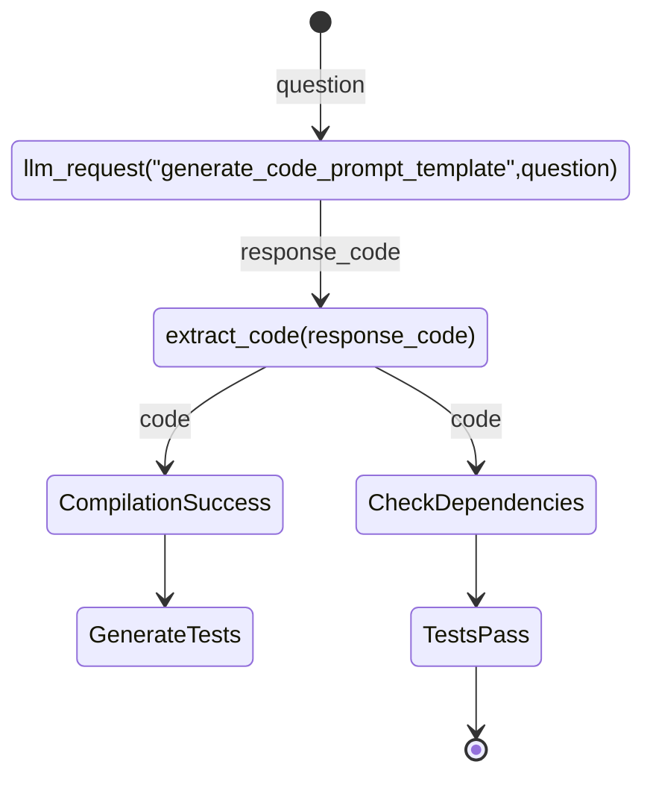

```mermaid
stateDiagram
[*] --> llm_request("generate_code_prompt_template",question) : question
llm_request("generate_code_prompt_template",question) --> extract_code(response_code) : response_code
extract_code(response_code) --> CompilationSuccess : code
extract_code(response_code) --> CheckDependencies : code
CompilationSuccess --> GenerateTests
CheckDependencies  --> TestsPass
TestsPass --> [*]
```

