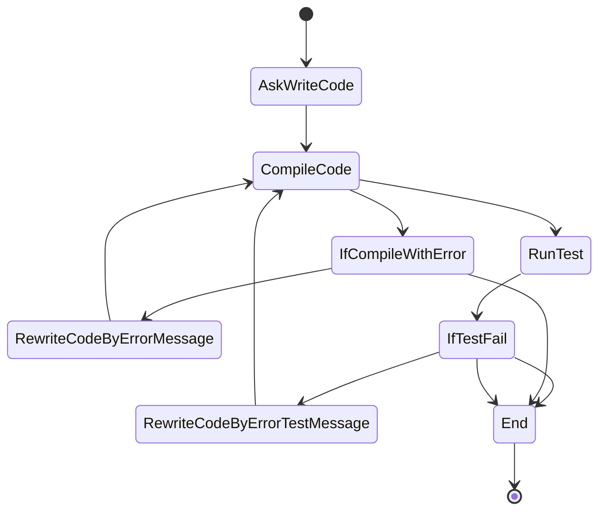
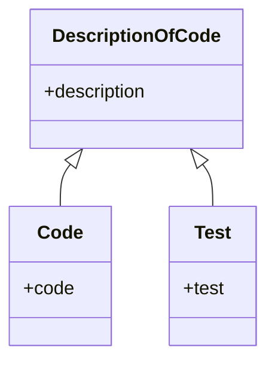

1. Ask write code
2. Compile code
3. If compile with error go to 4, else go to 5
4. Rewrite code by error message, go to 2
5. Run test
6. If test fail go to 7, else go to 7
7. Rewrite code by error test message, go to 2
8. End

State Diagram

Entity diagram

1. Description of code
2. Code
3. Test
