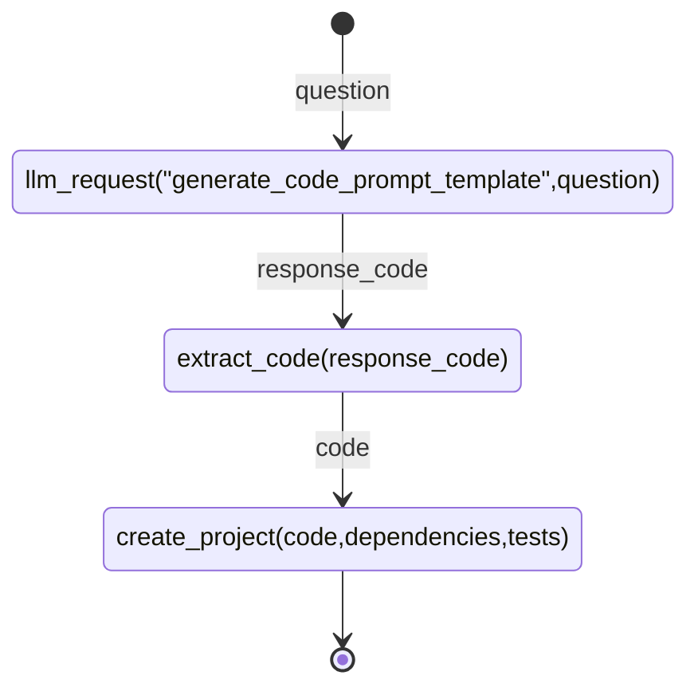

```rust
fn main() {
    let question = "take 2 params and multiply and return result";
    //...
}

fn create_project(code: &str, dependencies: &str, tests: &str) { }

fn llm_request(prompt: &str, params: Vec<&str>) -> String { }

fn extract_code(response: &str) -> String { }

fn extract_number(response: &str) -> i32 { }


```




