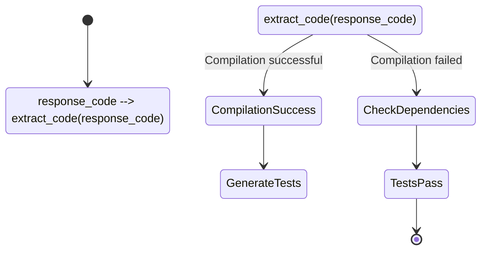

```mermaid
stateDiagram
[*] --> llm_request("generate_code_prompt_template",question)
llm_request("generate_code_prompt_template",question): response_code --> extract_code(response_code)
extract_code(response_code) --> CompilationSuccess : Compilation successful
extract_code(response_code) --> CheckDependencies : Compilation failed
CompilationSuccess --> GenerateTests
CheckDependencies  --> TestsPass
TestsPass --> [*]
```