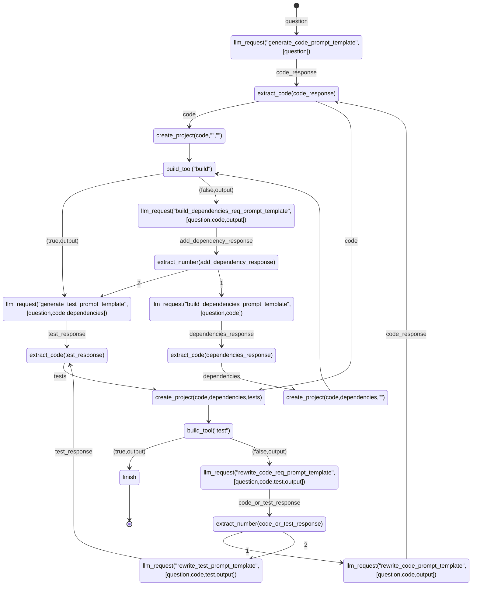

```mermaid
stateDiagram
[*] --> llm_request("generate_code_prompt_template",[question]) : question
llm_request("generate_code_prompt_template",[question]) --> extract_code(code_response) : code_response
extract_code(code_response) --> create_project(code,"","") : code
create_project(code,"","") --> build_tool("build")
create_project(code,dependencies,"") --> build_tool("build")
create_project(code,dependencies,tests) --> build_tool("test")
build_tool("test") --> finish : (true,output)
build_tool("test") --> llm_request("rewrite_code_req_prompt_template",[question,code,test,output]) : (false,output)
llm_request("rewrite_code_req_prompt_template",[question,code,test,output]) --> extract_number(code_or_test_response) : code_or_test_response
extract_number(code_or_test_response) --> llm_request("rewrite_code_prompt_template",[question,code,output]) : 1
extract_number(code_or_test_response) --> llm_request("rewrite_test_prompt_template",[question,code,test,output]) : 2
llm_request("rewrite_test_prompt_template",[question,code,test,output]) --> extract_code(test_response) : test_response
llm_request("rewrite_code_prompt_template",[question,code,output]) --> extract_code(code_response) : code_response
extract_code(code_response) --> create_project(code,dependencies,tests): code
build_tool("build") --> llm_request("generate_test_prompt_template",[question,code,dependencies]) : (true,output) 
build_tool("build") --> llm_request("build_dependencies_req_prompt_template",[question,code,output]) : (false,output) 
llm_request("build_dependencies_req_prompt_template",[question,code,output])  --> extract_number(add_dependency_response) : add_dependency_response
extract_number(add_dependency_response) --> llm_request("generate_test_prompt_template",[question,code,dependencies]) : 2
extract_number(add_dependency_response) --> llm_request("build_dependencies_prompt_template",[question,code]) : 1
llm_request("build_dependencies_prompt_template",[question,code]) --> extract_code(dependencies_response) : dependencies_response
extract_code(dependencies_response) --> create_project(code,dependencies,"") : dependencies 
llm_request("generate_test_prompt_template",[question,code,dependencies]) --> extract_code(test_response) : test_response
extract_code(test_response) --> create_project(code,dependencies,tests) : tests
finish --> [*]
```