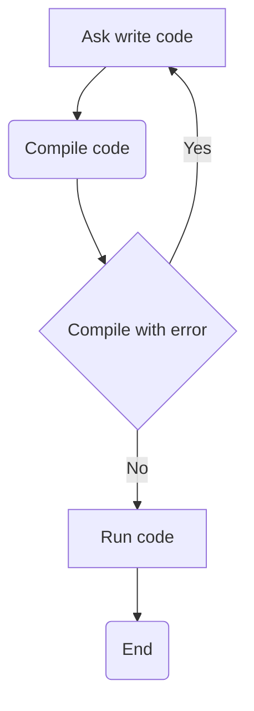

1. Ask write code
2. Compile code
3. If compile with error, go to 1
4. Run code

State Diagram

```mermaid
graph TD
    A[Ask write code] --> B(Compile code)
    B --> C{Compile with error}
    C -- No --> D[Run code]
    C -- Yes --> A
    D --> E(End)
```