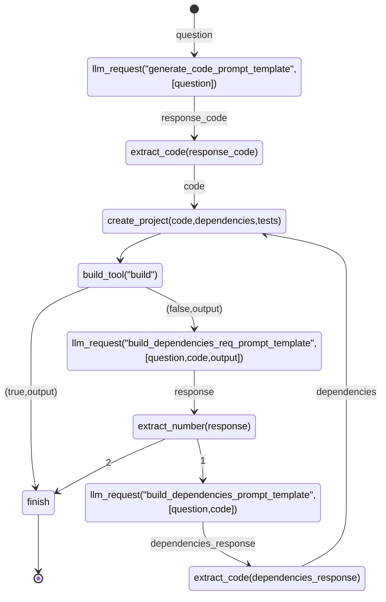

```rust
fn main() {
    let states = r#"
stateDiagram
[*] --> llm_request("generate_code_prompt_template",[question]) : question
llm_request("generate_code_prompt_template",[question]) --> extract_code(response_code) : response_code
extract_code(response_code) --> create_project(code,dependencies,tests) : code
create_project(code,dependencies,tests) --> build_tool("build")
build_tool("build") --> finish : (true,output) 
build_tool("build") --> llm_request("build_dependencies_req_prompt_template",[question,code,output]) : (false,output) 
llm_request("build_dependencies_req_prompt_template",[question,code,output])  --> extract_number(response) : response
extract_number(response) --> finish : 1
extract_number(response) -->  llm_request("generate_code_prompt_template",[question]) : 2
finish --> [*]
"#;
    let question = "take 2 params and multiply and return result";
    let mut code = "".to_string();
    let mut dependencies = "".to_string();
    let mut tests = "".to_string();
    
    run_state_machine(states, question, code, dependencies, tests);
    println!("{}/n{}/n{}", code, dependencies, tests);
}

fn create_project(code: &str, dependencies: &str, tests: &str) { }

fn llm_request(prompt: &str, params: Vec<&str>) -> String { }

fn extract_code(response: &str) -> String { }

fn extract_number(response: &str) -> i32 { }

fn build_tool(command: &str) -> (bool, String) { }

```




