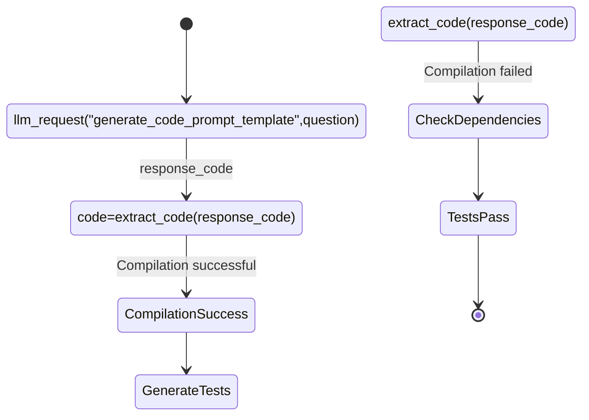
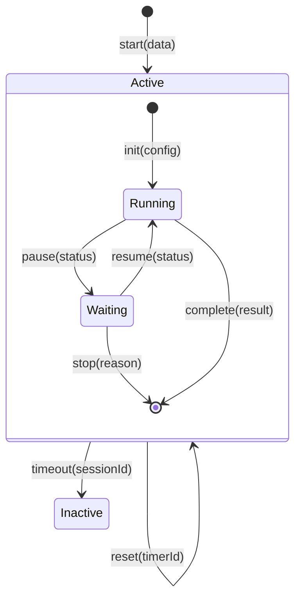

```mermaid
stateDiagram
[*] --> llm_request("generate_code_prompt_template",question)
llm_request("generate_code_prompt_template",question) --> code=extract_code(response_code) : response_code
code=extract_code(response_code) --> CompilationSuccess : Compilation successful
extract_code(response_code) --> CheckDependencies : Compilation failed
CompilationSuccess --> GenerateTests
CheckDependencies  --> TestsPass
TestsPass --> [*]
```

```mermaid
stateDiagram-v2
[*] --> Active: start(data)
Active --> Inactive: timeout(sessionId)
Active --> Active: reset(timerId)

    state Active {
        [*] --> Running: init(config)
        Running --> Waiting: pause(status)
        Waiting --> Running: resume(status)
        Waiting --> [*]: stop(reason)
        Running --> [*]: complete(result)
    }
```