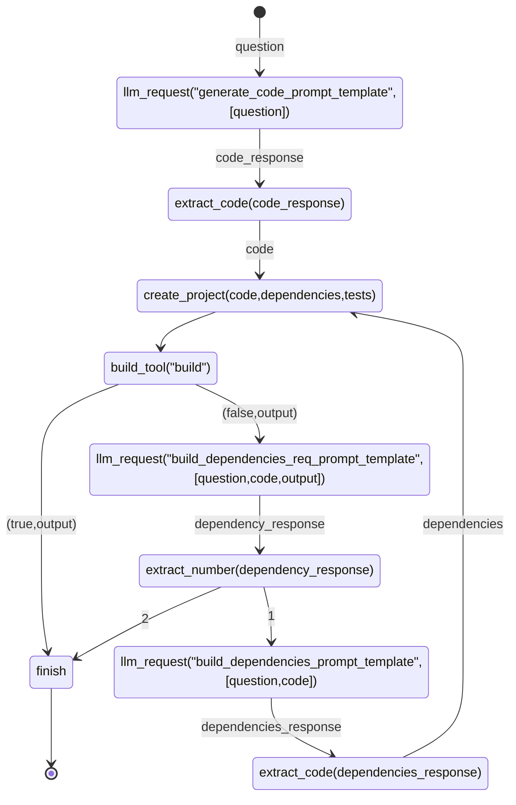

```mermaid
stateDiagram
[*] --> llm_request("generate_code_prompt_template",[question]) : question
llm_request("generate_code_prompt_template",[question]) --> extract_code(code_response) : code_response
extract_code(code_response) --> create_project(code,dependencies,tests) : code
create_project(code,dependencies,tests) --> build_tool("build")
build_tool("build") --> finish : (true,output) 
build_tool("build") --> llm_request("build_dependencies_req_prompt_template",[question,code,output]) : (false,output) 
llm_request("build_dependencies_req_prompt_template",[question,code,output])  --> extract_number(dependency_response) : dependency_response
extract_number(dependency_response) --> finish : 2
extract_number(dependency_response) --> llm_request("build_dependencies_prompt_template",[question,code]) : 1
llm_request("build_dependencies_prompt_template",[question,code]) --> extract_code(dependencies_response) : dependencies_response
extract_code(dependencies_response) --> create_project(code,dependencies,tests) : dependencies 
finish --> [*]
```

напиши реализацию функции run_state_machine(states, question, code, dependencies, tests) которая использует состояния и логику в формате mermaid
